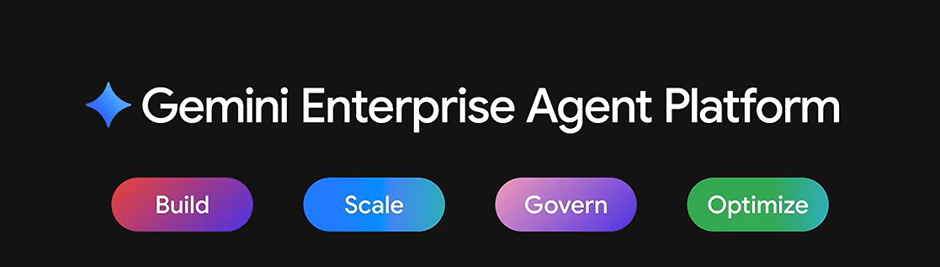
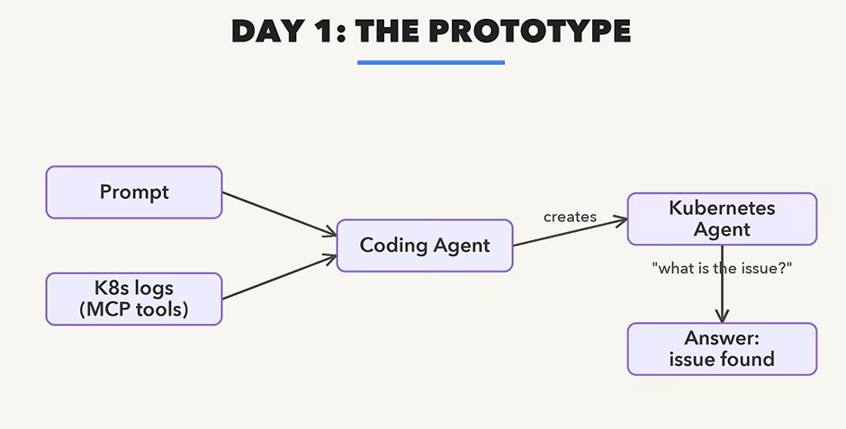
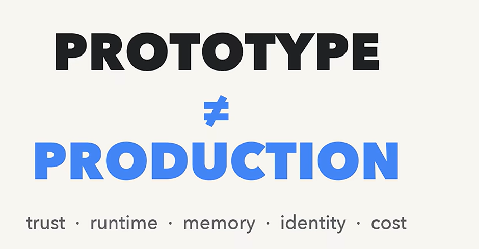
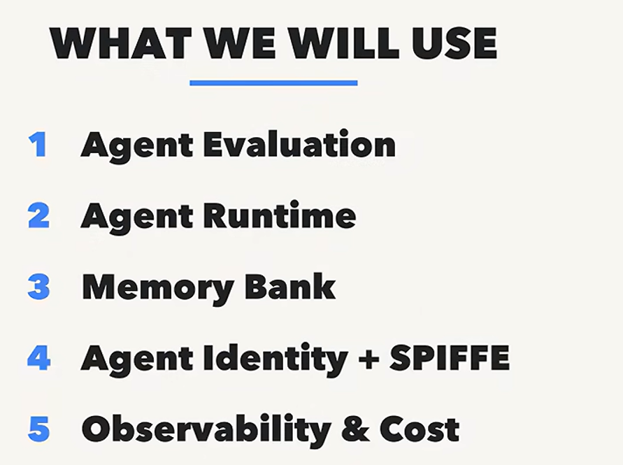

# AI Agent — From Prototype to Enterprise Production

## Series Overview

- The series focuses on building an AI agent from zero to production.
- It is a 10-video, project-driven series.
- Instead of learning concepts individually, concepts are learned by building a real-time project.
- The main project is a Kubernetes Investigation Agent.

## Complete Agent Lifecycle

The series covers four major areas:

1. Building an AI Agent
2. Deploying and Scaling the Agent
3. Governing the Agent
4. Observing the Agent in Production

## Technologies / Platform

- Gemini Enterprise Agent Platform
- Google Cloud Platform

The project is used to demonstrate how an AI agent moves from a prototype to an enterprise-grade system.

## Prototype vs Enterprise AI Agent

A prototype can demonstrate that an agent works. 

Prototype works fine for testing and understanding how to build an agent 
but for production it needs much more than that

A production agent must demonstrate that the agent is:

- Trustworthy
- Scalable
- Secure
- Observable
- Cost-controlled
- Governed
- Able to maintain relevant memory
- Properly identified and authorized

### Why a Prototype Cannot Directly Go to Production

When moving an AI agent to production, several important questions appear:

- Can we trust the agent's answers?
- Where will the agent run?
- Can it remember previous incidents?
- Who is the agent?
- What is the agent allowed to access?
- Can we see what the agent did?
- How much does the agent cost to run?
- Who is accountable for the agent?

These concerns are what separate a simple prototype from an enterprise production system.

## Main Enterprise AI Agent Features

| Production Concern | Feature / Approach |
|---|---|
| Trust / quality | Agent Evaluation |
| Deployment & scaling | Agent Runtime |
| Persistent context | Memory Bank |
| Identity & permissions | Agent Identity |
| Workload identity | SPIFFE |
| Monitoring | Google Cloud Observability |
| Cost control | Google Cloud Cost Management |
| Model selection | Model Garden |

## Interview / Revision Points

**Q1. What is the difference between Day 1 and Day 2 operations?**

- Day 1: Building and validating the prototype.
- Day 2: Operating the agent as a production/enterprise system. Day 2 introduces concerns such as scaling, trust, memory, identity, observability, and cost.

**Q2. Why can't a prototype directly go to production?**

Because a prototype may not address:

- Trustworthiness
- Scalability
- Runtime management
- Persistent memory
- Identity
- Permissions
- Observability
- Cost management
- Governance

**Q3. What is Agent Runtime?**

- Provides the production environment for deploying agents.
- Supports running and scaling agents.

**Q4. Why is Agent Evaluation required?**

- AI responses cannot be blindly trusted.
- Evaluation helps assess the quality of agent responses.

**Q5. What is Memory Bank?**

- Provides persistent memory.
- Allows an agent to maintain relevant context beyond a single interaction/session.

**Q6. Why does an agent need an identity?**

Because different agents may need different permissions.

Example:
- Investigation agent → Read access
- Infrastructure modification agent → Read + Write access

**Q7. Why is observability important?**

To understand:
- What the agent did
- When it did it
- What went wrong
- How successful it was

**Q8. Why is cost management important?**

Because production AI agents consume:
- Models
- Compute
- Infrastructure

Without monitoring, operational costs can increase significantly.

**Q9. What is Model Garden?**

- A place to explore and select different models.
- Includes Google and third-party models.
- Can help choose models appropriate for different workloads.

---

⭐ **One-Line Takeaway**

A prototype proves that an AI agent can work; an enterprise agent proves that it can be trusted, deployed, scaled, governed, observed, secured, and operated at an acceptable cost.
